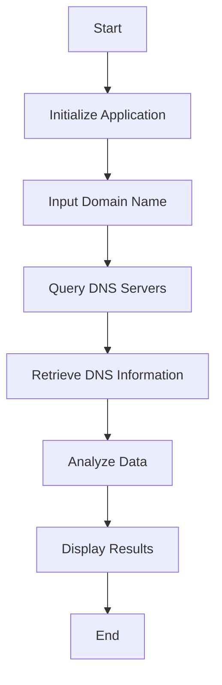

# DNS Locator

## Overview

DNS Locator is a tool designed to help users identify and locate DNS servers. It provides detailed information about DNS server locations and their performance metrics. This project aims to enhance network diagnostics and troubleshooting by offering a user-friendly interface and comprehensive data analysis.

## Features

- **DNS Server Identification**: Detects and lists DNS servers.
- **Location Mapping**: Provides geographical locations of DNS servers.
- **Performance Metrics**: Analyzes and displays response times and other performance indicators.
- **User-Friendly Interface**: Easy-to-use interface for both novice and advanced users.

## Installation

To install DNS Locator, follow these steps:

1. Clone the repository:
    ```bash
    git clone https://github.com/Megh2005/DNS-LOCATOR.git
    ```
2. Navigate to the project directory:
    ```bash
    cd DNS-LOCATOR
    ```
3. Install the required dependencies:
    ```bash
    pip install -r requirements.txt
    ```
4. Run the application:
    ```bash
    streamlit run app.py
    ```

## Usage

To start using DNS Locator, run the following command:
```bash
npm start
```

## Flowchart

Below is a flowchart illustrating the workflow of DNS Locator:



## Data Analysis Table

| Metric            | Description                              | Example Value |
|-------------------|------------------------------------------|---------------|
| DNS Server IP     | The IP address of the DNS server         | 8.8.8.8       |
| Location          | Geographical location of the DNS server  | Mountain View, CA, USA |
| Response Time     | Time taken to respond to a DNS query     | 20ms          |
| Uptime            | Percentage of time the server is operational | 99.99%        |

## Contributing

We welcome contributions to DNS Locator. Please follow these steps to contribute:

1. Fork the repository.
2. Create a new branch (`git checkout -b feature-branch`).
3. Commit your changes (`git commit -m 'Add new feature'`).
4. Push to the branch (`git push origin feature-branch`).
5. Create a new Pull Request.

## What is DNS?

The Domain Name System (DNS) is a hierarchical and decentralized naming system for computers, services, or other resources connected to the Internet or a private network. It translates human-readable domain names (like www.example.com) into IP addresses (like 192.0.2.1) that computers use to identify each other on the network. DNS is essential for the functionality of the internet, as it allows users to access websites using domain names instead of memorizing complex IP addresses.

## References

For more information about DNS and its workings, you can refer to the following resources:

- [Wikipedia: Domain Name System](https://en.wikipedia.org/wiki/Domain_Name_System)
- [How DNS Works](https://howdns.works/)
- [MDN Web Docs: Introduction to DNS](https://developer.mozilla.org/en-US/docs/Web/HTTP/Basics_of_HTTP/Domain_Name_System)
- [Google Public DNS](https://developers.google.com/speed/public-dns/docs/intro)
- [Cloudflare DNS](https://www.cloudflare.com/learning/dns/what-is-dns/)

## History of DNS

The Domain Name System (DNS) was introduced by Paul Mockapetris and Jon Postel in 1983. Before DNS, the ARPANET used a simpler, centralized system called the HOSTS.TXT file, maintained by the Stanford Research Institute. As the internet grew, this system became impractical due to the increasing number of hosts. DNS was created to address this scalability issue by distributing the responsibility of name resolution across a decentralized network of servers.

Key milestones in the history of DNS include:
- **1983**: Introduction of DNS in RFC 882 and RFC 883.
- **1984**: First implementation of DNS in the Berkeley Internet Name Domain (BIND) software.
- **1987**: DNS specifications updated in RFC 1034 and RFC 1035.
- **1990s**: Widespread adoption of DNS with the growth of the World Wide Web.
- **2000s**: Introduction of security extensions (DNSSEC) to address vulnerabilities in DNS.

## Risks of DNS

While DNS is a critical component of the internet, it is not without risks. Some of the common risks associated with DNS include:

- **DNS Spoofing (Cache Poisoning)**: Attackers insert false DNS records into the cache of a resolver, redirecting users to malicious sites.
- **DNS Amplification Attacks**: Attackers exploit DNS servers to amplify the volume of traffic in a Distributed Denial of Service (DDoS) attack.
- **DNS Tunneling**: Attackers use DNS queries and responses to exfiltrate data or establish command and control channels.
- **DNS Hijacking**: Attackers redirect queries to malicious DNS servers, often by compromising routers or modifying DNS settings.
- **Privacy Concerns**: DNS queries are typically unencrypted, allowing eavesdroppers to monitor user activity and track browsing behavior.

To mitigate these risks, it is essential to implement security measures such as DNSSEC, use encrypted DNS protocols like DNS over HTTPS (DoH) or DNS over TLS (DoT), and regularly monitor and update DNS infrastructure.

