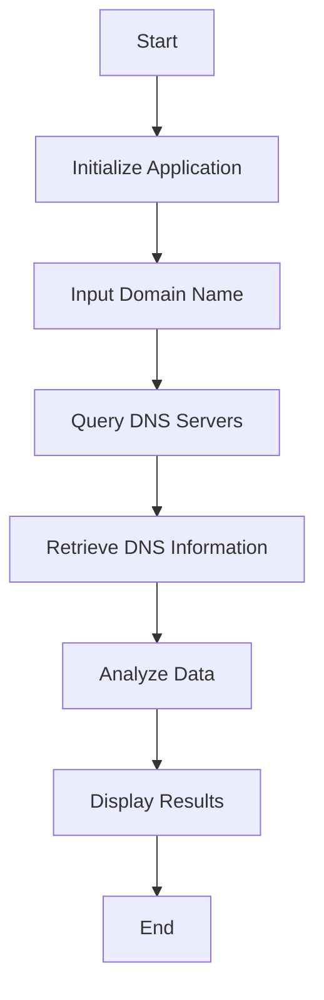

# DNS Locator

## Overview

DNS Locator is a tool designed to help users identify and locate DNS servers. It provides detailed information about DNS server locations and their performance metrics. This project aims to enhance network diagnostics and troubleshooting by offering a user-friendly interface and comprehensive data analysis.

## Features

- **DNS Server Identification**: Detects and lists DNS servers.
- **Location Mapping**: Provides geographical locations of DNS servers.
- **Performance Metrics**: Analyzes and displays response times and other performance indicators.
- **User-Friendly Interface**: Easy-to-use interface for both novice and advanced users.

## Installation

To install DNS Locator, follow these steps:

1. Clone the repository:
    ```bash
    git clone https://github.com/Megh2005/DNS-LOCATOR.git
    ```
2. Navigate to the project directory:
    ```bash
    cd dns-locator
    ```
3. Install the required dependencies:
    ```bash
    npm install
    ```

## Usage

To start using DNS Locator, run the following command:
```bash
npm start
```

## Flowchart

Below is a flowchart illustrating the workflow of DNS Locator:



## Data Analysis Table

| Metric            | Description                              | Example Value |
|-------------------|------------------------------------------|---------------|
| DNS Server IP     | The IP address of the DNS server         | 8.8.8.8       |
| Location          | Geographical location of the DNS server  | Mountain View, CA, USA |
| Response Time     | Time taken to respond to a DNS query     | 20ms          |
| Uptime            | Percentage of time the server is operational | 99.99%        |

## Contributing

We welcome contributions to DNS Locator. Please follow these steps to contribute:

1. Fork the repository.
2. Create a new branch (`git checkout -b feature-branch`).
3. Commit your changes (`git commit -m 'Add new feature'`).
4. Push to the branch (`git push origin feature-branch`).
5. Create a new Pull Request.

## License

This project is licensed under the MIT License. See the [LICENSE](LICENSE) file for details.

## Contact

For any questions or feedback, please contact us at support@dnslocator.com.
